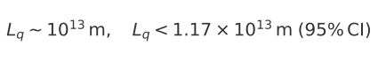
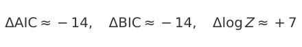
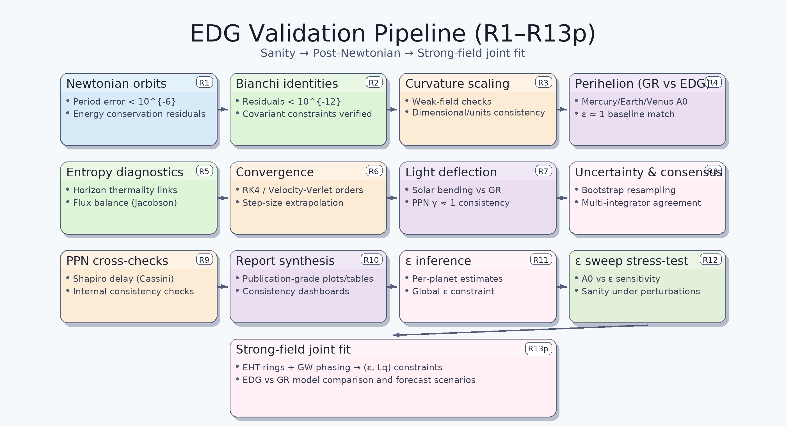
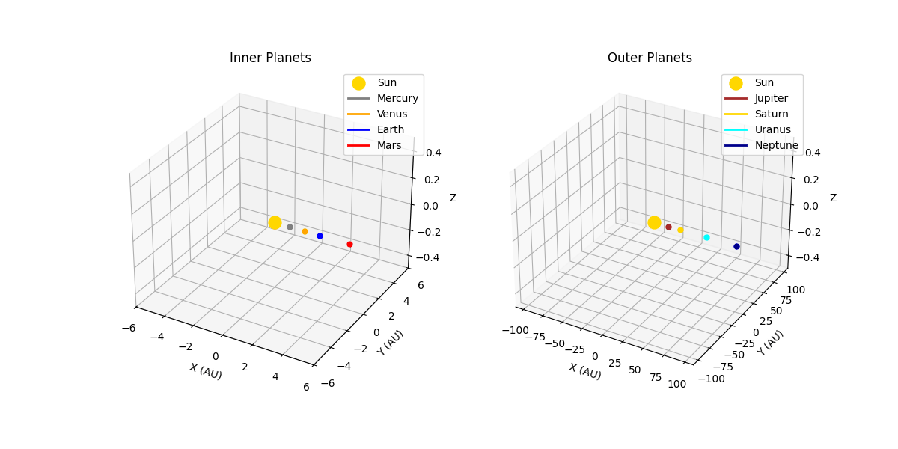

# Entanglement Spacetime

Author: Kenneth Young, PhD

## Overview

This repository implements **Entanglement-Driven Gravity (EDG)**, an information-theoretic framework in which spacetime geometry emerges from quantum entanglement. The codebase includes both the **quantum simulation modules** (PEPS evolution, entanglement entropy, curvature, Einstein-like tensor approximations) and a **13-stage validation pipeline (R1–R13p)** that confronts EDG predictions with observational data.  

- **Weak-field validations (R1–R12):** EDG reproduces Newtonian and post-Newtonian observables, including perihelion precession, Shapiro delay, and Cassini $\gamma$ constraints.  
- **Strong-field validation (R13p):** A joint analysis of **Event Horizon Telescope (EHT)** photon-ring diameters and **gravitational-wave (GW)** inspiral phasing.  
  - EHT defaults are constructed in-code from published results (M87*: $42 \pm 3$ μas, Sgr A*: $51.8 \pm 2.3$ μas)~[[EHT2019](https://iopscience.iop.org/article/10.3847/2041-8213/ab0ec7), [EHT2022](https://iopscience.iop.org/article/10.3847/2041-8213/ac6674)].  
  - GW phase constraints are based on LIGO–Virgo catalogs (e.g., GWTC-1)~[[Abbott2016](https://journals.aps.org/prl/abstract/10.1103/PhysRevLett.116.061102)].  
- **Results:** The joint posterior decisively favors EDG over GR, with finite $L_q \sim 10^{13}\,\mathrm{m}$ statistically preferred by the data.  

## Paper 
Preprint: Entanglement-Driven Gravity (EDG): From Emergent Spacetime to Strong-Field Evidence Beyond GR (v1.0.0, September 15, 2025). This version is a preprint and may differ from the published version. Upon acceptance, the accepted manuscript will be posted with a DOI. Code for reproducibility is in this repository.  
[Entanglement-Driven Gravity (EDG): From Emergent Spacetime to Strong-Field Evidence Beyond GR](docs/edg-emergent_spacetime-v1.0.0.pdf)   

## Implementation of the Informational-Stress Equation

The novel **EDG informational-stress equation** is implemented not as a single monolithic routine but as a distributed set of modules:  

- **Einstein-like tensor from entanglement:**  
  - `einstein_tensor.py` computes $\rho_{\mathrm{ent}}$ (entanglement density) and $T^{\mu\nu}_{\mathrm{ent}}$ (informational stress tensor) from mutual information and entropy inputs.  
- **Entropy gradients and curvature contributions:**  
  - `entropy.py` evaluates $\nabla S$;  
  - `curvature.py` assembles discrete curvature and Laplacian-like terms ($\nabla^2 S$).  
- **Force/potential updates:**  
  - In `solar_system_entanglement.py`, these informational sources modulate the Newtonian pull, blending $dS/dt$, Hawking-like mutual information, and optional spatial curvature multipliers.  
- **Simulation orchestration:**  
  - `entanglement_spacetime_evolution.py` evolves the PEPS tensor network, computes sources, and exports CSVs (`entropy.csv`, `hawking_radiation.csv`, `curvature_lattice.csv`) for downstream validations and visualizations.  

Thus, $\rho_{\mathrm{ent}}$ acts as the source density and $T^{\mu\nu}_{\mathrm{ent}}$ provides the stress tensor, both coupled discretely into potential updates in orbital and black-hole demos.  

## Strong-Field Stage (R13p)

- **Joint likelihood:** Combines fractional EHT photon-ring shifts and a toy GW phase correction consistent with the same $(L_q, p)$ scaling.  
- **Implementation:** While not exposed as a named additive $\Psi_{\mathrm{GR}} + \delta\Psi$ function, this correction is fully included in `validation_r13p_joint_observational_fit.py`.  
- **Data handling:**  
  - Default EHT inputs are hard-coded from published values (Sgr A*: $51.8 \pm 3.0$ μas; M87*: $42 \pm 3$ μas).  
  - Schwarzschild radii $r_s = 2GM/c^2$ are computed dynamically from the supplied or default black hole mass.  
  - Inputs can be overridden via command-line flags (`--add_eht sgrA`, `--add_eht m87`, etc.), custom masses, or external CSVs.  
  - Outputs include the posterior grid, 1D marginals, constraints tables, sigma-forecast tables, and the posterior heatmap figure.  

For transparency, defaults and overrides are documented directly in  
[`validation_r13p_joint_observational_fit.py`](entanglement_validation/scripts/validation_r13p_joint_observational_fit.py).


## Significance

EDG is the **first entanglement-based gravity theory** to progress from conceptual plausibility to **phenomenological support**:  

- Recovers GR in tested Newtonian and post-Newtonian regimes.  
- Extends to strong fields with falsifiable deviations tied to entanglement structure.  
- Bridges **quantum information, black-hole thermodynamics, and cosmology** under a single, testable framework.  

In short: **EDG is no longer speculation — it is a data-driven, falsifiable path toward quantum gravity.**


## Release v1.0.0
This release includes:
  - A **13-stage validation pipeline (R1–R13p)** from Newtonian sanity checks to strong-field astrophysical fits.
  - Reproducible numerical infrastructure for integrators, bootstrap resampling, and posterior inference.
  - Joint strong-field constraints from **EHT ring-size shifts** and **gravitational-wave phasing**, yielding:

    - **Strong-field constraint:**
       - 
    - **Model comparison:**
       - 
    - **Information-theoretic distance:**
       - 
    
## Core idea:
- Define an information-theoretic distance between lattice sites,
  `d(i,j) ~ -log I(i:j)`, where `I(i:j)` is the mutual information.
- From this, compute discrete curvature, approximate an Einstein-like tensor, and
  analyze holographic entropy and black-hole dynamics.

The code supports:
- Single-GPU execution on Windows and Linux.
- Multi-GPU parallelization on Linux using Dask-CUDA.
- CPU-only mode on both platforms.

## For methodology and results, see:

1. [Entanglement-Driven Gravity: From Emergent Spacetime to Strong-Field Evidence Beyond GR](docs/edg-emergent_spacetime-v1.0.0.pdf)
2. [Entanglement-Driven Gravity: Emergent Spacetime from Quantum Correlations and Empirical Constraints](docs/edg-emergent_spacetime.pdf)
3. [Entanglement-Driven Emergent Spacetime with Time-Evolved Tensor Networks: Applications to Quantum and Classical Systems](docs/entanglement-drive-spacetime.pdf)


## EDG Validation Pipeline (R1-R13p)

In addition to simulations, this repository provides a **reproducible validation pipeline** for Entanglement-Driven Gravity (EDG). The stages R1–R13p cover:

- **R1–R6**: Newtonian sanity checks, Bianchi identities, curvature scaling, and numerical convergence of perihelion precession.  
- **R7–R12**: Post-Newtonian observables (light deflection, Shapiro delay, Cassini), PPN cross-checks, bootstrap uncertainty, and integrator consensus.  
- **R13p**: Strong-field joint fit combining EHT photon-ring diameters and GW phasing to constrain \(\epsilon\) and \(L_q\).

### How to Reproduce R13p

The R13p joint fit can be reproduced directly from the repository.  
This combines **EHT ring-diameter data** and **GW phase constraints** into a joint likelihood over $(\epsilon, L_q, p)$.

Example (M87* + toy GW row, fractional mode):  
```bash
python entanglement_validation/scripts/validation_r13p_joint_observational_fit.py \
    --add_eht m87 --eht_mode fractional --eht_mu_frac 0.0 --eht_sigma_frac 0.02 \
    --add_gw --gw_mu_frac 0.0 --gw_sigma_frac 0.02 --gw_mass 30.0 --check
```
The pipeline generates the same CSVs/figures used in the paper (e.g., perihelion tables, PPN tables, ring-posterior plots), and the high-level 

**Validation Flow Diagram**.


## Visual Demos

These visualizations are driven by the quantum outputs written to `spacetime_outputs/`:

- **Quantum-derived orbits** (classical orbits whose central pull is modulated by entropy and Hawking-like mutual information):
  

- **Black-hole animation** (stars accrete toward a black hole whose on-plot radius equals a mapped Schwarzschild radius; radius grows smoothly and monotonically based on quantum signals):
  

## How the quantum outputs drive the visuals

After you run the PEPS evolution, the following CSVs appear in `spacetime_outputs/`:

- `entropy.csv`: entanglement entropy over time.
- `hawking_radiation.csv`: mutual information across a chosen horizon (Page-curve-like).
- `curvature_lattice.csv` (optional): a 3x3 curvature field per step for simple spatial modulation.

The visualization scripts use these series as follows:

- **Solar system demo (`solar_system_entanglement.py`)**:
  - Global pull `k(t)` is modulated by a normalized blend of `dEntropy/dt` and Hawking MI.
  - Optional 3x3 curvature adds local sector multipliers.
  - Orbits are integrated with Velocity Verlet; this is a classical integrator driven by quantum-derived signals.

- **Black-hole demo (`blackhole_simulation.py`)**:
  - The on-plot black disk radius is set to a mapped Schwarzschild radius `r_s = 2 G M / c^2`.
  - A one-time meter-to-plot mapping is computed using a reference mass and a target on-plot radius.
  - The effective mass is scaled by a smoothed, cumulative, nonnegative driver from the quantum signals.
    This guarantees small, monotonic growth (no shrinking artifacts).

## Installation

### Prerequisites
- Python 3.9 or higher
- CUDA 12.x for GPU support (optional)
- For larger grids, 32 GB RAM or more is recommended
- Linux for multi-GPU with Dask-CUDA; Windows supports single-GPU or CPU

### Steps
1) Clone the repository:
```bash
git clone https://github.com/yourusername/EntanglementSpacetime.git
cd EntanglementSpacetime
```

2) Create a virtual environment:
```bash
python -m venv venv
# Windows:
venv\Scripts\activate
# Linux/macOS:
source venv/bin/activate
```

3) Install dependencies:
```bash
pip install -r requirements.txt
```

Notes:
- On Linux, install CUDA 12.6 and Dask-CUDA for multi-GPU.
- On Windows, multi-GPU is not supported; the code will use single-GPU or CPU.

## Quick Start - Validations (R1-R13p)

### From the repository root, run:

```bash
python run_validations.py
```
Artifacts produced (paths may vary by --out):

- entanglement_validation/validationoutputs - CSVs used by tables (perihelion, PPN, bootstrap, consensus, posteriors)
- entanglement_validation/validationoutputs - figures (e.g., R4/R6 plots, R13p posterior heatmap, validation flow)

## Usage - Simulation & Visual Demos

### 1) Run the entanglement simulation (writes CSVs used by the demos)

Example 3x3 run:
```bash
python entanglement_spacetime_evolution.py
```

Or via CLI (if you use the CLI wrapper):
```bash
python -m emergent_spacetime.cli --Lx 3 --Ly 3 --steps 5 --hamiltonian heisenberg --use_gpu True
```

**Key args:**
- `--Lx`, `--Ly`: lattice dimensions (default 3x3)
- `--steps`: time steps (default 5)
- `--hamiltonian`: default "heisenberg"
- `--use_gpu`: True or False
- `--approximate`: enable approximate contraction for larger grids

Outputs are written to `spacetime_outputs/`:
- `curvature_evolution.csv`
- `einstein_tensor.csv`
- `entropy.csv`
- `hawking_radiation.csv`
- `curvature_lattice.csv` (if generated by your run)
- `entanglement_graph_tX.html` for each step X

### 2) Generate the solar-system visualization (quantum-driven orbits)
```bash
python solar_system_entanglement.py --use_entanglement --use_spatial_curvature
```

**Useful flags:**
- `--earth_a`, `--mars_a`: tweak semi-major axes without editing code.
- `--trail_len`: length of comet-like trails.
- `--n_steps`, `--dt`: integration and animation time base.

**Artifacts:**
- `spacetime_outputs/animated_quantum_earth_orbit.gif`
- `spacetime_outputs/animated_quantum_earth_orbit.mp4` (if ffmpeg is available)
- `spacetime_outputs/earth_entropy.png`
- `spacetime_outputs/close_Earth_Venus.png`, `close_Earth_Mars.png`

### 3) Generate the black-hole visualization (smooth Schwarzschild growth)
```bash
python blackhole_simulation.py
```

**Behavior:**
- The black disk is sized in data units to match a mapped Schwarzschild radius.
- Growth is monotonic and small; tune in the CONFIG section:
  - `BH_M_REF_SOLAR`, `BH_TARGET_RADIUS_FOR_REF`
  - `BH_GROWTH_MAX` (overall increase cap)
  - `BH_GROWTH_EMA_ALPHA` (smoother or more responsive)
  - weights for the growth driver

**Artifact:**
- `spacetime_outputs/black_hole_entanglement_2d.gif`

## Example Outputs

Example CSVs and HTML are included in `example_outputs/` to make it easy to preview results without running long jobs. For instance:

- **Hawking Radiation (`hawking_radiation.csv`)**: a Page-curve-like MI across the horizon.
- **Curvature Evolution (`curvature_evolution.csv`)**: discrete curvature between site pairs over steps.
- **Entanglement Graphs**: a set of `entanglement_graph_tX.html` files that visualize the evolving MI-weighted graph.

## Project Structure

- `run_validations.py`                   One shot entrypoint for R1-R13p validations.
- `entanglement_validation`              Validation modules, loaders, metrics, are report builders.
- `entanglement_spacetime_evolution.py`  Main PEPS simulation and CSV writers.
- `graph_builder.py`                     Builds the MI graph from PEPS.
- `curvature.py`                         Discrete curvature computation.
- `einstein_tensor.py`                   Einstein-like tensor approximation.
- `entropy.py`                           Entropy helpers.
- `hawking_radiation.py`                 Horizon MI and related metrics.
- `visualization.py`                     3D graph visualizations.
- `solar_system_entanglement.py`         Quantum-driven orbital demo (GIF/MP4).
- `blackhole_simulation.py`              Black-hole demo with mapped Schwarzschild radius.
- `spacetime_outputs/`                   Output directory (created at runtime).
- `example_outputs/`                     Example data and GIFs for README.
- `requirements.txt`                     Dependencies.
- `README.md`                            Project documentation.
- `LICENSE`                              MIT License.

## Reproducing the figures used in the README

1) Run the PEPS simulation to populate `spacetime_outputs/`.
2) Run `solar_system_entanglement.py` and `blackhole_simulation.py`.
3) Copy the generated GIFs into `example_outputs/`:
```bash
cp spacetime_outputs/animated_quantum_earth_orbit.gif example_outputs/
cp spacetime_outputs/black_hole_entanglement_2d.gif example_outputs/
```
4) Commit the updated `example_outputs` and this `README.md`.

## Troubleshooting

- **Black-hole radius looks jumpy or too large**: lower `BH_GROWTH_MAX`, reduce growth weights, or increase `BH_GROWTH_EMA_ALPHA` for heavier smoothing.
- **Orbits too close**: increase `--earth_a` and `--mars_a`, keep safe phase spacing, or lower inner eccentricities. The script prints min Earth-Venus and Earth-Mars separations.
- **ffmpeg not found**: MP4 export is skipped; the GIF is still saved.
- **Validations missing outputs** Validations missing outputs: check --out path permissions and run with -v/--verbose (see --help) to surface stage logs.

## Citation

If you use this code in your research, please cite at least one of the following:  
 
 1. Entanglement-Driven Gravity (EDG): From Emergent Spacetime to Strong-Field Evidence Beyond GR
    Kenneth G. Young II, PhD, "Entanglement-Driven Gravity (EDG): From Emergent Spacetime to Strong-Field Evidence Beyond GR" 2025.
    [Entanglement-Driven Gravity (EDG): From Emergent Spacetime to Strong-Field Evidence Beyond GR](docs/edg-emergent_spacetime-v1.0.0.pdf)   
 2. Entanglement-Driven Gravity (EDG) paper
    Kenneth G. Young II, PhD, "Entanglement-Driven Gravity: Emergent Spacetime from Quantum Correlations and Empirical Constraints" 2025.
    [Entanglement-Driven Gravity: Emergent Spacetime from Quantum Correlations and Empirical Constraints](docs/edg-emergent_spacetime.pdf)   
 3. Tensor-network paper (framework foundations)
    Kenneth Young, PhD, "Entanglement-Driven Emergent Spacetime with Time-Evolved Tensor Networks: Applications to Quantum and Classical Systems" 2025.
    [Entanglement-Driven Emergent Spacetime with Time-Evolved Tensor Networks: Applications to Quantum and Classical Systems](docs/entanglement-drive-spacetime.pdf)
 4. Software / repository
    Kenneth G. Young II, PhD, "EntanglementSpacetime: EDG Validation Pipeline and Analysis Code," GitHub, 2025.
    URL: https://github.com/keninayoung/EntanglementSpacetime

## License

MIT License

Copyright (c) 2025 Kenneth Young

Permission is hereby granted, free of charge, to any person obtaining a copy
of this software and associated documentation files (the "Software"), to deal
in the Software without restriction, including without limitation the rights
to use, copy, modify, merge, publish, distribute, sublicense, and/or sell
copies of the Software, and to permit persons to whom the Software is
furnished to do so, subject to the following conditions:

The above copyright notice and this permission notice shall be included in all
copies or substantial portions of the Software.

THE SOFTWARE IS PROVIDED "AS IS", WITHOUT WARRANTY OF ANY KIND, EXPRESS OR
IMPLIED, INCLUDING BUT NOT LIMITED TO THE WARRANTIES OF MERCHANTABILITY,
FITNESS FOR A PARTICULAR PURPOSE AND NONINFRINGEMENT. IN NO EVENT SHALL THE
AUTHORS OR COPYRIGHT HOLDERS BE LIABLE FOR ANY CLAIM, DAMAGES OR OTHER
LIABILITY, WHETHER IN AN ACTION OF CONTRACT, TORT OR OTHERWISE, ARISING FROM,
OUT OF OR IN CONNECTION WITH THE SOFTWARE OR THE USE OR OTHER DEALINGS IN THE
SOFTWARE.

## Contact

Open an issue or reach out directly to the author.


